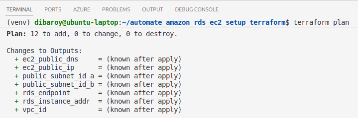
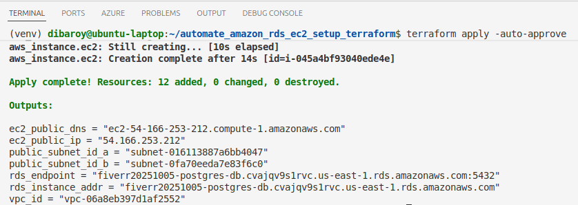
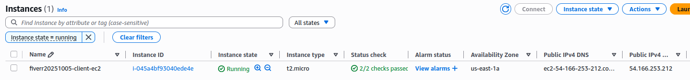
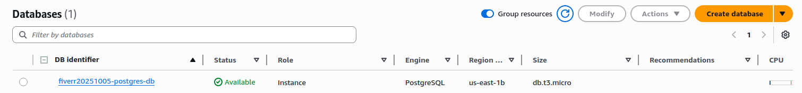
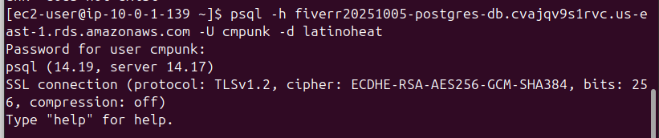
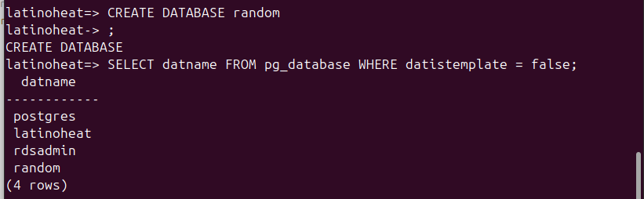

# AWS Infrastructure Operations Project: RDS PostgreSQL-EC2 Integration Setup

### Introduction
For this project, you will write a Terraform template to deploy a customizable, PG-RDS EC2 Connect in AWS.

### Getting Started
1. Clone this repository.

2. Create your infrastructure as code.
The main steps under this are as follows:
    * Creating a Terraform template
    * Deploying the infrastructure

3. Update this README to reflect how someone would use your code.

### Dependencies
1. Create an [AWS Account](https://console.aws.amazon.com/console/home) 
2. Install the [AWS command line interface](https://docs.aws.amazon.com/cli/latest/userguide/getting-started-install.html)
3. Install [Terraform](https://www.terraform.io/downloads.html)

### Instructions

## Step 1: Create the infrastructure Terraform Template
Create the infrastructure template for the application to run on. Here are the main steps:
* Create a Virtual Private Cloud (VPC) and a couple of public subnets on that virtual network.
* Create a Network Security Group. Ensure that you explicitly allow access to other VMs on the subnet and deny direct access from the internet.
* Create a Network Interface.
* Create a Public IP.
* Create a Load Balancer. Your load balancer will need a backend address pool and address pool association for the network interface and the load balancer.
* Create a virtual machine availability set.
* Create virtual machines. Make sure you use the image you deployed using Packer!
* Create managed disks for your virtual machines.
* Ensure a variables file allows for customers to configure the number of virtual machines and the deployment at a minimum.

This project contains a 'main.tf' file that needs to be updated with above mentioned resources to create the infrastructure template which is often referred to Infrastructure as Code [IaC].

### ==========================================================

### Input Variables:
Input variables serve as parameters for a Terraform module, allowing aspects of the module to be customized without altering the module's own source code, and allowing modules to be shared between different configurations.

1. Declaring an Input Variable:
    * Each input variable accepted by a module must be declared using a variable block. 
    * The label after the variable keyword is a name for the variable, which must be unique among all variables in the same module. This name is used to assign a value to the variable from outside and to reference the variable's value from within the module.
    * The variable declaration can also include a default argument. If present, the variable is considered to be optional and the default value will be used if no value is set when calling the module or running Terraform.

2. Input Variable Documentation:
    * The purpose of each variable can be briefly described using the optional description argument.

This project contains a 'var.tf' file to store such variables which will be referred by the Terraform infrastructure template described in the 'main.tf' file.
Variables that are stored and defined in the 'vars.tf' are as follows:
* location
* prefix
* db_username
* db_password
* main_db
* public_key_path

### ==========================================================

## Step 2: Deploying the infrastructure
Once your code is ready, you'll use Terraform to deploy your infrastructure (making sure to run terraform plan with the -out flag, and save the plan file with the name solution.plan) and ensure the following:
* Run 'terraform plan -out solution.plan' [Please refer to Screenshot 1 in the Output section].
* Deploy your Terraform infrastructure by running 'terraform apply' [Please refer to Screenshot 2 in the Output section] and don't forget to terraform destroy it once you're done!.
* Verify the resources being created [Please refer to Screenshot 3 in the Output section].
* Create and verify the 'random' database that was being asked [Please refer to Screenshot 4 in the Output section].


### Output
## Screenshot 1: Terraform Plan
Please see the snapshot of the successful 'terraform plan' command mentioned below:


## Screenshot 2: Terraform Apply
Please see the snapshot of the successful 'terraform apply' command to deploy the infrastructure mentioned below:


## Screenshot 3: Created resources
Please see the snapshot of the successfully created EC2 instance on the AWS console mentioned below:


Please see the snapshot of the successfully created RDS instance on the AWS console mentioned below:


## Screenshot 4: Create 'random' database
Please see the snapshot of the successful PSQL client connectivity mentioned below:


Please see the snapshot of the successfully created 'random' database mentioned below:


Kindly ensure to delete this database before running the 'terraform destroy' command to avoid any infrastructure drift.


### The files included are:
```sh
* /project_snapshots: Folder containing the screenshots the results
* main.tf: File containing the Terraform infrastructure template
* vars.tf: File containing the variables to be used in the Terraform infrastructure template
* scripts/init.sh: File containing the shell script to install the PSQL client
* output.tf: File containing the output variables required to capture the EC2 public IP and RDS instance endpoint
* issues.docx: File containing the issues/errors encountered during the project that can be referenced in future
```
